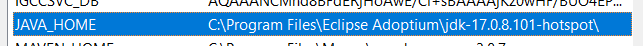

# GanaMóvil - Backend for Frontend

## Introducción
Este es el Backend para el nuevo GanaMóvil en React Native.

## Primeros Pasos
Para instalar y ejecutar el proyecto, sigue estos pasos:
- Instalar **Open JDK 17 LTS.**
- Verificar o agregar que esté el __JAVA_HOME__ en las variables de entorno del sistema.
- Tener instalado IntelliJ o su editor favorito.

# Build and Test
TODO: Describe and show how to build your code and run the tests. 

# Contribute
TODO: Explain how other users and developers can contribute to make your code better.

If you want to learn more about creating good readme files then refer the following [guidelines](https://docs.microsoft.com/en-us/azure/devops/repos/git/create-a-readme?view=azure-devops). You can also seek inspiration from the below readme files:
- [ASP.NET Core](https://github.com/aspnet/Home)
- [Visual Studio Code](https://github.com/Microsoft/vscode)
- [Chakra Core](https://github.com/Microsoft/ChakraCore)